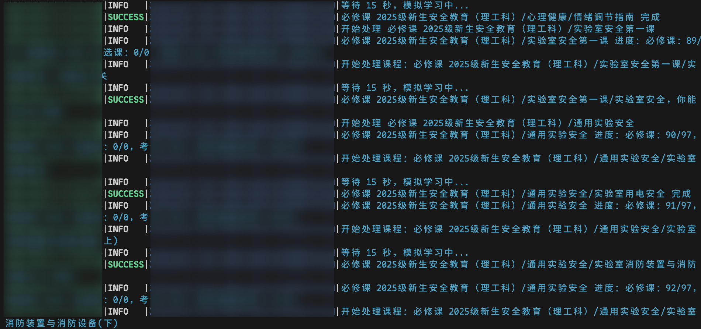
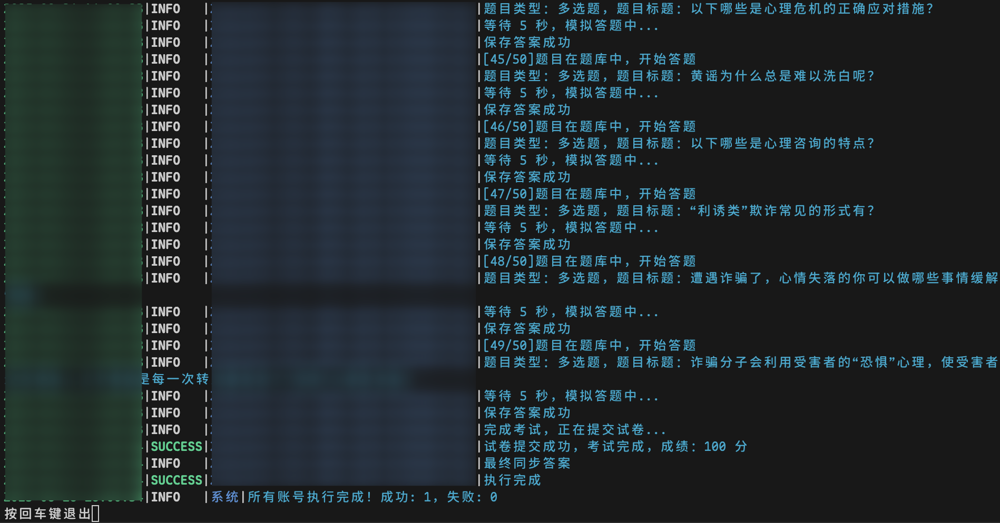
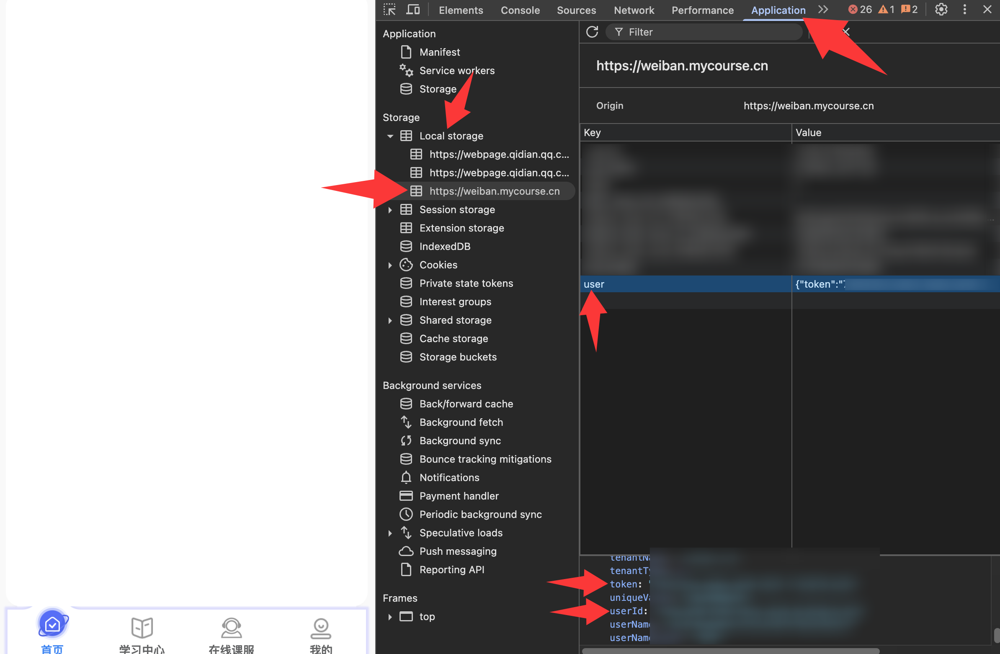
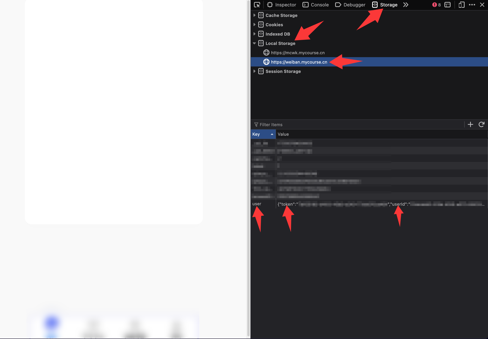

# _WeBan_ 安全微课 安全微伴 大学安全教育

> **由于验证码换成了腾讯云，暂时无法完成部分需要验证码的课程。**

## 介绍

如果本项目帮到了你，可以在右上角点亮 Star，谢谢你！

实现了课程学习和根据题库自动考试，支持多用户多线程运行（配置 config.json），自动验证码识别（需要源码运行，安装 ddddocr）。

运行前后会自动合并题库，如果一次没满分可以再考一次。 可将 answer/answer.json 文件提交 PR 一起完善题库。

## 使用

从 [Releases](https://github.com/hangone/WeBan/releases) 下载 WeBan.exe 单文件运行，根据提示输入信息。

| 类型    | 镜像下载地址                                                                                           | Github 下载地址                                                                        |
| ------- | ------------------------------------------------------------------------------------------------------ | -------------------------------------------------------------------------------------- |
| Windows | [镜像下载地址](https://ghfast.top/https://github.com/hangone/WeBan/releases/latest/download/WeBan.exe) | [Github 下载地址](https://github.com/hangone/WeBan/releases/latest/download/WeBan.exe) |
| Linux   | [镜像下载地址](https://ghfast.top/https://github.com/hangone/WeBan/releases/latest/download/WeBan)     | [Github 下载地址](https://github.com/hangone/WeBan/releases/latest/download/WeBan)     |

## 配置说明

软件使用至少需要 `tenant_name` `userId` `token` 三个参数，可参考[常见问题](#常见问题)获取。

```json
// config.json
[
  {
    "tenant_name": "学校名称",
    "account": "账号",
    "password": "密码",
    "study": true, // 是否学习课程，默认开启
    "study_time": 15, // 每节课学习时间，单位（秒），默认 15 秒
    "exam": true, // 是否考试，默认开启
    "exam_use_time": 250 // 考试总时间，单位（秒），会平均到每到题上，默认 250 秒
  },
  // 或者
  {
    "tenant_name": "学校名称", // 与 user 字段的二选一，优先使用 user 字段的
    "user": {
      "userId": "可以从浏览器F12->存储->Local Storage->user 中找到",
      "token": "可以从浏览器F12->存储->Local Storage->token 中找到",
      "tenantName": "学校名称" // 二选一，会优先使用这个
    },
  }
]
```

## 源码运行

1.  安装 Python3([下载地址](https://www.python.org/downloads))（可选使用 [uv](https://github.com/astral-sh/uv)）和 Git([下载地址](https://git-scm.com))

2.  打开终端，克隆本仓库

```bash
git clone --depth 1 https://github.com/hangone/WeBan # 如果太慢可以执行 git clone --depth 1 https://ghfast.top/https://github.com/hangone/WeBan
```

3. 安装依赖

```bash
pip install -r requirements.txt # 或 uv sync
```

4. 运行

```bash
python main.py
```

按提示输入学校和账号密码。每个任务大概需要 15 秒才不会触发限制。

## 演示





## 常见问题

- ### 部分无法直接登录的学校/Token 登录方法

有些从迎新系统跳转的可以试试账号密码都是学号，比如北京交通大学

其他学校可使用 Token 登录，在电脑浏览器登录后按 F12 或者 Ctrl+Shift+I 打开开发者工具，找到本地存储，复制 user 的内容到 config.json 配置文件




- ### 下载

如果被浏览器拦截请放行。如果密码输入错误，请删除 config.json 文件后重试

- ### 学习

1. 有腾讯云验证码的还不支持完成

2. 学习进度不更新可能是被风控遇到了需要验证码的课程，请去网页上完成一次后重试

- ### 考试

如果遇到“系统检测到您的行为存在异常”，可以在网页开启一次考试后重新运行，使用 Token 登录

## 鸣谢

- [Coaixy/weiban-tool](https://github.com/Coaixy/weiban-tool) 提供题库和一些代码思路

- [pooneyy/WeibanQuestionsBank](https://github.com/pooneyy/WeibanQuestionsBank) 提供题库

## 其他

1. 本项目仅供学习交流使用，请勿用于商业用途，否则后果自负。

2. 欢迎 Star 喵，欢迎 PR 喵。

3. 截图时注意打码个人信息。

4. **如果看不懂上面说的也可以直接扫码备注学校和账号密码（建议留言微信号），乐意效劳。**

   |             微信             |            支付宝            |
   | :--------------------------: | :--------------------------: |
   |  |  |
