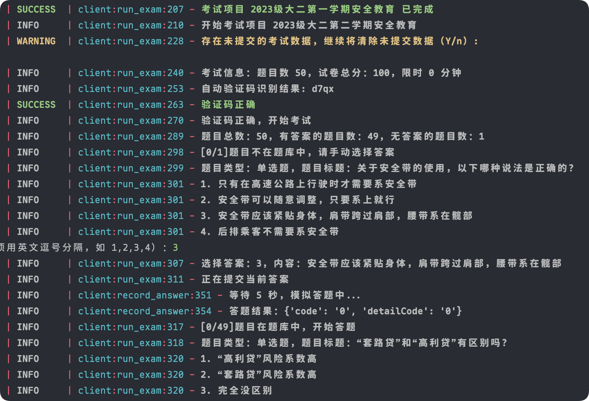

# *WeBan*

## 介绍

*WeBan* 安全微伴-大学安全教育 学习工具

实现了课程学习和根据题库自动考试，支持多用户，自动验证码识别（需要安装 ddddocr）。

运行前后会自动合并题库，如果一次没满分可以再考一次。 可将 answer/answer.json 文件提交 PR 一起完善题库。

## 直接使用

从 [Releases](https://github.com/hangone/WeBan/releases) 下载 WeBan.exe 单文件运行，根据提示输入。

[Github 下载地址](https://github.com/hangone/WeBan/releases/latest/download/WeBan.exe)

[镜像下载地址](https://ghfast.top/https://github.com/hangone/WeBan/releases/latest/download/WeBan.exe)

## 源码运行

1. 安装 Python3 （可选使用 [uv](https://github.com/astral-sh/uv)）

2. 打开终端，克隆本仓库 `git clone https://github.com/hangone/WeBan`

3. 在终端运行 `pip install -r requirements-ocr.txt` 或者 `uv sync`

4. 运行 `python main.py`，按提示输入学校和账号密码。每个任务大概需要 ≥13 秒才不会触发限制。

### 演示

### 其他

本项目仅供学习交流使用，请勿用于商业用途，否则后果自负。

截图时注意打码个人信息

欢迎 PR

### 鸣谢

[Coaixy/weiban-tool](https://github.com/Coaixy/weiban-tool) 提供题库和一些代码思路

[pooneyy/WeibanQuestionsBank](https://github.com/pooneyy/WeibanQuestionsBank) 提供题库