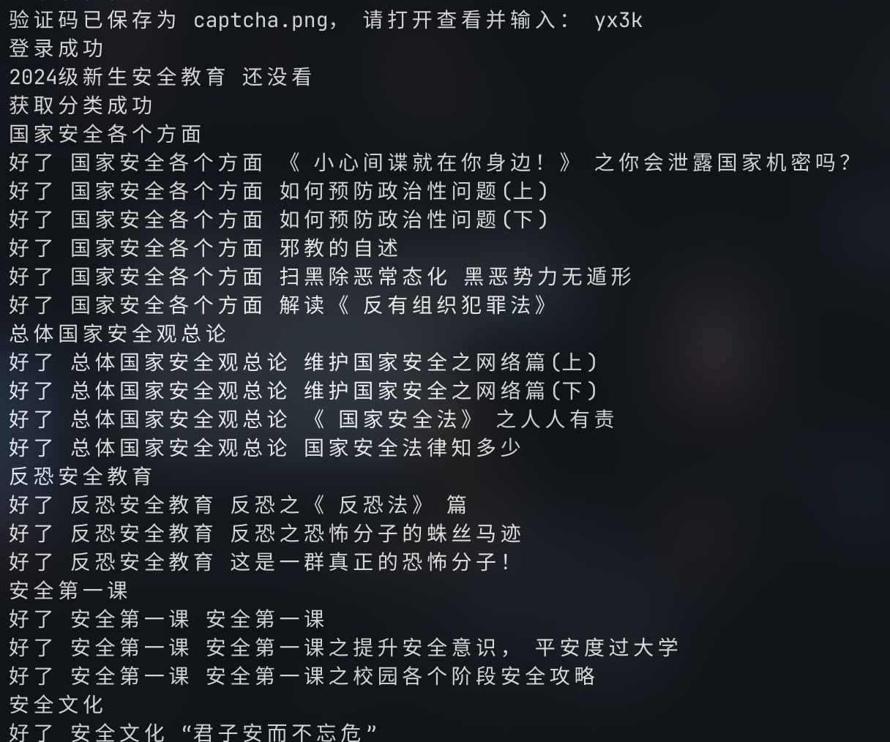

# *WeBan*

## 介绍

*WeBan* 安全微伴-大学安全教育 刷课脚本

## 直接使用

直接从 Releases 下载 .exe 单文件运行，根据提示输入，中途报错请重试

[网络好下载地址](https://github.com/hangone/WeBan/releases/latest/download/WeBan.exe)

[镜像下载地址](https://mirror.ghproxy.com/https://github.com/hangone/WeBan/releases/latest/download/WeBan.exe)

## 源码运行

简单的安装方式如下，仅需 5 步

1. 安装 Python3，应该会自带 pip 包管理器

2. 打开终端，克隆本仓库 git clone https://github.com/hangone/WeBan

3. 在终端运行 pip install requests pycryptodome 或者 pip install -r requirements.txt

4. 编辑 WeBan.py，修改 11-13 行的配置信息。其他行应该可以不用动，当然想二次开发也是可以

5. 运行 python WeBan.py，打开验证码图片输入验证码，等待即可。每个任务需要需要 15 秒才能完成，太快会被 Ban，符合标题

### 演示

### 其他

仅供学习交流使用，如果有空会补充下实现过程。