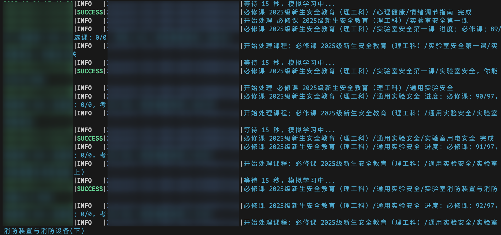
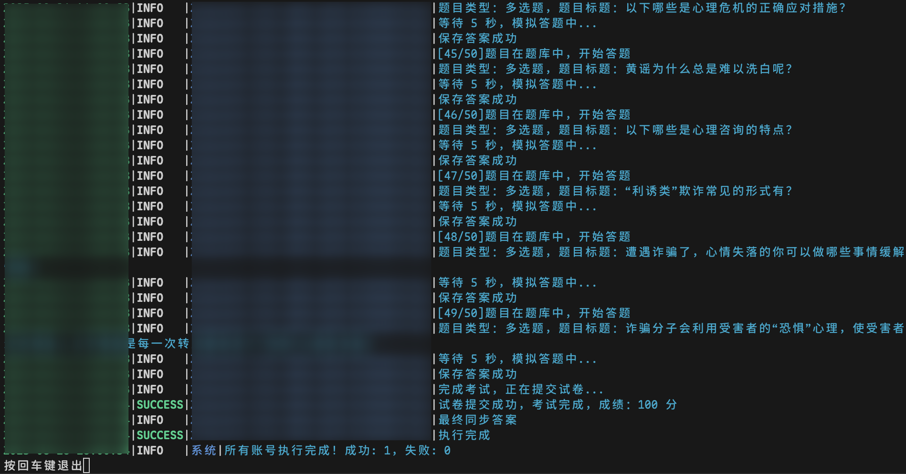
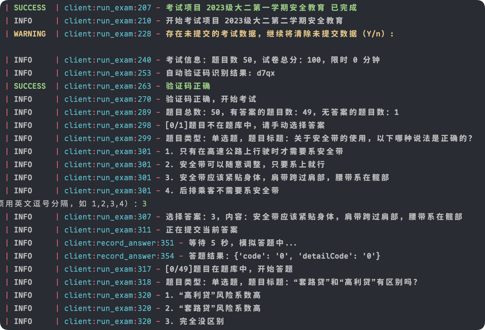
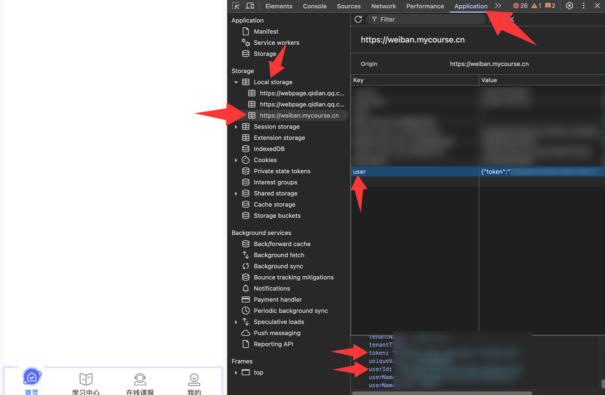
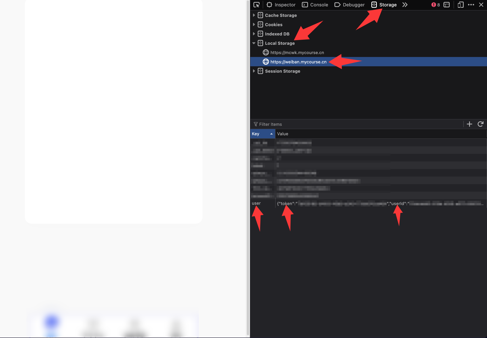

# _WeBan_ 安全微课 安全微伴 大学安全教育

## 介绍

如果本项目帮到了你，可以在右上角点亮 Star，谢谢你！

实现了课程学习和根据题库自动考试，支持多用户多线程运行，自动验证码识别（需要源码运行，安装 ddddocr）。

运行前后会自动合并题库，如果一次没满分可以再考一次。可将 `answer/answer.json` 文件提交 PR 一起完善题库。

## 使用

### 源码运行

1. 安装 Python 3（可选使用 [uv](https://github.com/astral-sh/uv)）和 Git

2. 克隆本仓库

```bash
git clone --depth 1 https://github.com/hangone/WeBan
```

3. 安装依赖

```bash
pip install -r requirements.txt # 或 uv sync
```

4. 运行

```bash
python main.py # 或 uv run main.py
```

### 构建产物

从 [Releases](https://github.com/hangone/WeBan/releases/latest) 下载文件运行，根据提示输入信息。下载缓慢可以用 [https://gh-proxy.com/](https://gh-proxy.com/) 加速下载。

- **Online 模式**：体积小，首次运行需联网下载依赖
- **Bundle 模式**：体积大，完全打包依赖运行

| 平台 | 下载地址 | 镜像下载地址 |
|------|---------------|---------------|
| Windows x64 | [WeBan-windows-x64.exe](https://github.com/hangone/WeBan/releases/latest/download/WeBan-windows-x64.exe) | [WeBan-windows-x64.exe](https://gh-proxy.com/https://github.com/hangone/WeBan/releases/latest/download/WeBan-windows-x64.exe) |
| Linux x64 | [WeBan-linux-x64](https://github.com/hangone/WeBan/releases/latest/download/WeBan-linux-x64) | [WeBan-linux-x64](https://gh-proxy.com/https://github.com/hangone/WeBan/releases/latest/download/WeBan-linux-x64) |
| Linux arm64 | [WeBan-linux-arm64](https://github.com/hangone/WeBan/releases/latest/download/WeBan-linux-arm64) | [WeBan-linux-arm64](https://gh-proxy.com/https://github.com/hangone/WeBan/releases/latest/download/WeBan-linux-arm64) |
| macOS arm64 | [WeBan-macos-arm64](https://github.com/hangone/WeBan/releases/latest/download/WeBan-macos-arm64) | [WeBan-macos-arm64](https://gh-proxy.com/https://github.com/hangone/WeBan/releases/latest/download/WeBan-macos-arm64) |
| macOS x64 | [WeBan-macos-x64](https://github.com/hangone/WeBan/releases/latest/download/WeBan-macos-x64) | [WeBan-macos-x64](https://gh-proxy.com/https://github.com/hangone/WeBan/releases/latest/download/WeBan-macos-x64) |

### Docker

**完整镜像**（内置 Chromium，开箱即用）：

```bash
docker run -it --rm \
  -v "$PWD/config.toml":/app/config.toml:ro \
  -v "$PWD/logs":/app/logs \
  hangyi/weban
```

## 配置说明

首次使用先从 [config.example.toml](config.example.toml) 复制一份 `config.toml` 并填写账号信息。账号级配置可覆盖全局设置。

## 功能特性

- **课程学习**：自动遍历项目 → 分类 → 课程，模拟翻页、答题、等待学习时长后完课
- **自动考试**：基于题库自动答题，支持单选/多选，未匹配题目可随机作答或手动输入
- **验证码识别**：自动识别滑块验证码（需源码运行 + ddddocr），腾讯点选验证码需手动操作
- **多账号并发**：支持配置多个账号，可多线程同时执行
- **题库同步**：考试前后自动从服务器同步题库，支持多用户共享
- **断点续考**：追求满分模式下，一次未满分可再次考试
- **进度监控**：完课后自动检查进度是否更新，未更新则警告提示
- **调试模式**：开启 `debug` 可查看完整请求/响应日志

## 演示





## 常见问题

- ### 部分无法直接登录的学校/Token 登录方法

有些从迎新系统跳转的可以试试账号密码都是学号，也可以尝试使用 Token 登录，在电脑浏览器登录后按 F12 或者 Ctrl+Shift+I 打开开发者工具，找到本地存储，复制 user 的内容到 config.json 配置文件




- ### 学习

1. 学习时长太低不会计入进度
2. 有腾讯云验证码的还不支持自动完成，会弹出浏览器窗口手动操作
2. 学习进度不更新可能是被风控，遇到了需要验证码的课程，请去网页上完成一次后重试

- ### 考试


1. 据观察，考试未提交是不会消耗考试次数的

## 鸣谢

- [Coaixy/weiban-tool](https://github.com/Coaixy/weiban-tool) 提供题库和一些代码思路
- [pooneyy/WeibanQuestionsBank](https://github.com/pooneyy/WeibanQuestionsBank) 提供题库

## 其他

1. 本项目仅供学习交流使用，请勿用于商业用途，否则后果自负。
2. 欢迎 Star 喵，欢迎 PR 喵。
3. 截图时注意打码个人信息。
4. **如果看不懂上面说的也可以直接扫码备注学校和账号密码（建议留言微信号），乐意效劳。**

   |             微信             |            支付宝            |
   | :--------------------------: | :--------------------------: |
   |  |  |
